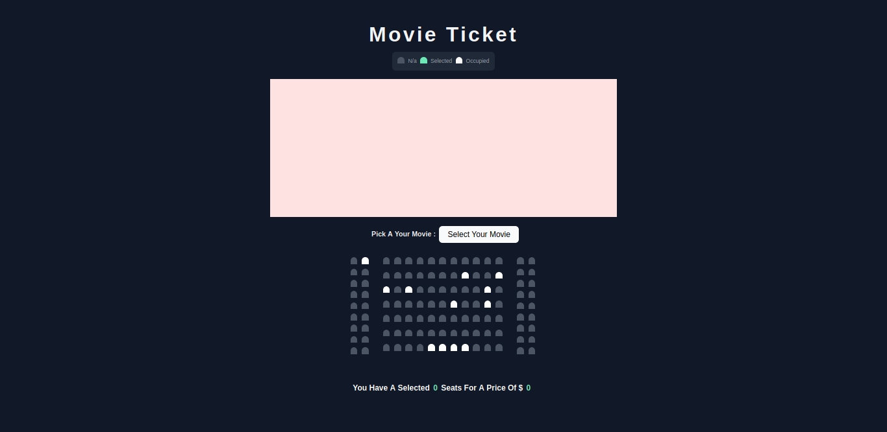

## Introducing 

 This is a movie boking ticket that is built using tailwind css and javascript.

## Instalation 
- Create tailwind.css
  - Include tailwind in your css (tailwind.css)
    - @tailwind base;
    - @tailwind components;
    - @tailwind utilities;   
- Running "npm run tw:build"
- And for production run "npm run tw:start" 

## Features 
- Simple . 
- With Javascript 
- Select on change movie title . 
-update total price. 
- update total seat selected . 

## Demo you can see live demo in <a href="https://andriferry.com/portfolio/booking-ticket">here</a>
